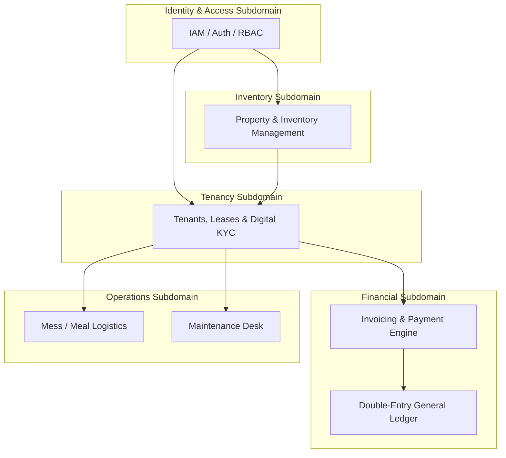
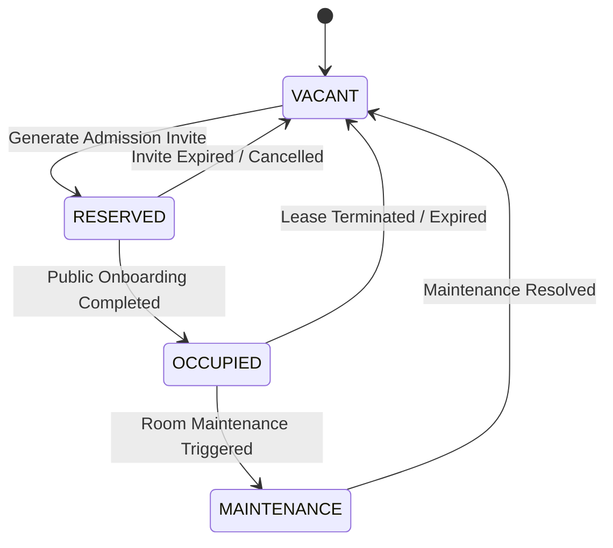
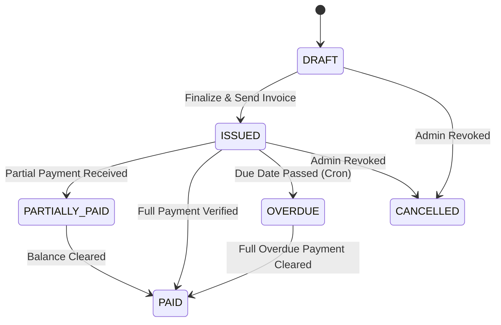
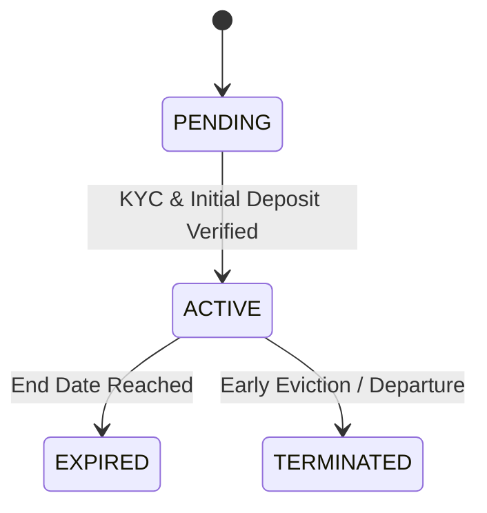
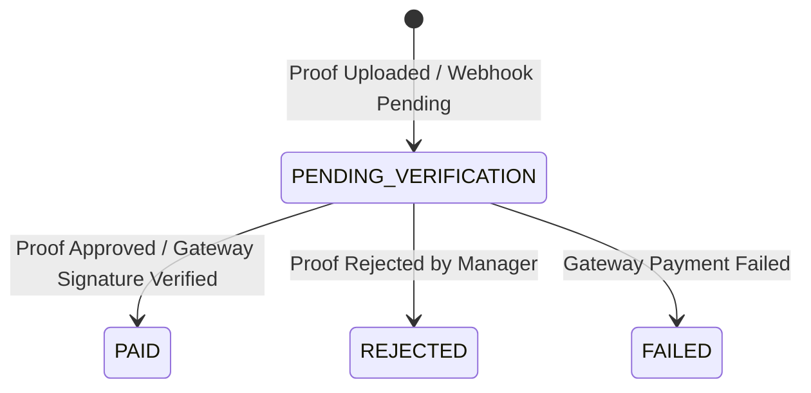
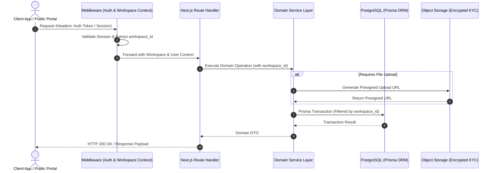

# Architecture Handbook (v2.0)
**System Architecture & Domain-Driven Design (DDD) Specification**  
*PG / Hostel Management SaaS Platform (Pg_SAS)*

---

## 1. Executive Summary & Core Design Principles

The **Pg_SAS** platform is built as an enterprise-grade, multi-tenant SaaS application designed for managing Hostels, PGs (Paying Guest accommodations), Co-living spaces, and Rentals.

### Core Architectural Principles
1. **Strict Multi-Tenant Isolation**: Workspace boundaries are non-negotiable. Every database query, state transition, and storage object must be strictly partitioned by `workspace_id`.
2. **Domain-Driven Design (DDD)**: Logic is partitioned into explicit Bounded Contexts with rich domain aggregates.
3. **Double-Entry Financial Integrity**: Financial transactions enforce strict accounting principles (Debits must equal Credits) with an audit trail via General Ledger entries.
4. **Idempotency & Resilience**: Financial and state-altering operations must be safe against network retransmissions and duplicate submissions using idempotency keys.
5. **Decoupled Architecture**: Built on Next.js App Router, Prisma ORM, and PostgreSQL, leveraging asynchronous background jobs for heavy workloads (invoicing, webhooks, notifications).

---

## 2. DDD Bounded Contexts



### Context Definitions
1. **Identity & Access Management (IAM)**: Authenticates users, enforces workspace tenant boundaries, and manages Role-Based Access Control (RBAC: `PLATFORM_SUPER_ADMIN`, `WORKSPACE_ADMIN`, `MANAGER`, `STAFF`, `TENANT`).
2. **Property & Inventory Context**: Manages physical structures: Workspace -> Property -> Floor -> Room -> Bed.
3. **Tenancy & Admissions Context**: Handles tokenized prospective tenant invites, KYC document storage, tenant onboarding, and active lease lifecycle management.
4. **Financial & Ledger Context**: Handles invoice generation, BYO payment gateways (Razorpay, Cashfree, PhonePe, Stripe), manual payment proof uploads, payment verification queues, and General Ledger posting.
5. **Mess & Meal Logistics Context**: Manages daily menus, slot cutoff rules, tenant dietary choices (Veg/Non-Veg/Skip), and kitchen headcount aggregates.
6. **Operations & Maintenance Context**: Handles tenant complaints, ticket assignments, priority levels, and resolution status tracking.

---

## 3. Finite State Machines (FSM)

### 3.1 Bed Occupancy FSM


### 3.2 Invoice Lifecycle FSM


### 3.3 Lease Lifecycle FSM


### 3.4 Payment Verification FSM


---

## 4. Request Flow Architecture



---

## 5. API Standards & Error Conventions

### Endpoint Naming
- Admin/Manager APIs: `/api/[domain]` (e.g., `/api/properties`, `/api/tenants`, `/api/invoices`)
- Tenant Portal APIs: `/api/tenant/[domain]` (e.g., `/api/tenant/invoices`, `/api/tenant/meals`)
- Public Admissions: `/api/tenants/admission/public/[token]`

### Standard Error Response Format
```json
{
  "error": "Human readable error summary",
  "code": "SPECIFIC_ERROR_CODE",
  "details": null,
  "status": 400
}
```

### Standard HTTP Status Codes
- `200 OK`: Successful read/update
- `201 Created`: Entity successfully created
- `400 Bad Request`: Validation failure or bad input
- `401 Unauthorized`: Missing or invalid auth token
- `403 Forbidden`: Insufficient role or workspace mismatch
- `404 Not Found`: Resource does not exist
- `409 Conflict`: Business rule state conflict (e.g. Bed already OCCUPIED)
- `422 Unprocessable Entity`: Business logic invariant failed
- `500 Internal Server Error`: Unexpected server failure

---

## 6. Multi-Tenant Security & Idempotency Rules

### 6.1 Multi-Tenant Isolation
- **Rule 1**: NEVER write a Prisma query without explicit `workspace_id` filtering, e.g.:
  ```typescript
  await prisma.bed.findFirst({
    where: { id: bedId, workspace_id: session.workspaceId }
  });
  ```
- **Rule 2**: Foreign keys between entities must belong to the same `workspace_id`.
- **Rule 3**: Admin endpoints enforce role checking via `requireRole(['WORKSPACE_ADMIN', 'MANAGER'])`.

### 6.2 Idempotency Rules
- Invoice generation and payment processing require idempotency tokens or unique transaction references (`transaction_ref`).
- Duplicate webhooks from payment gateways must be safely handled using event ID tracking to prevent double-crediting.

---

## 7. Testing Matrix & AI Agent Rules

| Test Category | Target Coverage | Scope & Strategy |
| :--- | :--- | :--- |
| **Unit Tests** | 85%+ | Domain logic, FSM transitions, ledger calculation math |
| **Integration Tests** | 80%+ | Prisma DB route handlers, atomic transactions |
| **Multi-Tenant Security Tests** | 100% | Cross-tenant access isolation verification |
| **E2E Tests** | Critical Flows | Full admission flow, invoice payment & receipt verification |

### AI Agent Rules
1. Always preserve established DB naming (`snake_case` in schema, `camelCase` in TS code).
2. Never comment out existing tests or fail silently on unexpected errors.
3. Every state update must record an `AuditLog` entry.
