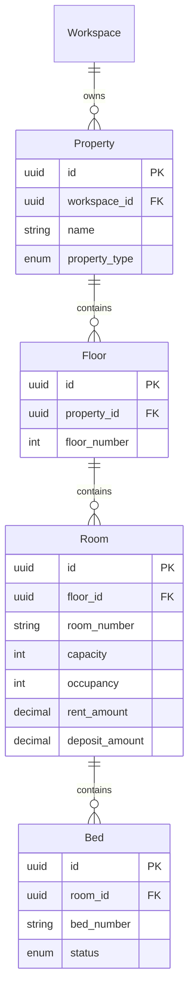

# Canonical Data Model Specification (v2.0)
**Database Schema, Entity Definitions, Attributes & Constraint Specification**  
*PG / Hostel Management SaaS Platform (Pg_SAS)*

---

## 1. Overview & Data Architecture

The database model is defined using PostgreSQL via Prisma ORM. The architecture is strictly multi-tenant using a **Shared Database, Shared Schema** approach where every entity (with the exception of platform global aggregates) is scoped by a mandatory `workspace_id` foreign key.

### Key Naming Conventions
- Database Tables & Columns: `snake_case` (e.g., `workspace_id`, `created_at`, `is_active`)
- Foreign Key Constraints: Direct cascading deletes on workspace parent deletion (`onDelete: Cascade`)
- Primary Keys: UUID v4 (`@default(uuid()) @db.Uuid`)

---

## 2. Global Enums

```prisma
enum UserRole {
  PLATFORM_SUPER_ADMIN
  WORKSPACE_ADMIN
  MANAGER
  STAFF
  TENANT
}

enum PropertyType {
  HOSTEL
  PG
  APARTMENT
  RENTAL
  COLIVING
}

enum BedStatus {
  VACANT
  OCCUPIED
  MAINTENANCE
  RESERVED
}

enum LeaseStatus {
  PENDING
  ACTIVE
  EXPIRED
  TERMINATED
}

enum InvoiceStatus {
  DRAFT
  ISSUED
  PARTIALLY_PAID
  PAID
  OVERDUE
  CANCELLED
}

enum PaymentStatus {
  PENDING_VERIFICATION
  PAID
  REJECTED
  FAILED
}

enum PaymentSource {
  GATEWAY
  MANUAL_UPLOAD
  MANUAL_UPLOAD_VERIFIED
  CASH
  BANK_TRANSFER
}

enum MealSlotType {
  BREAKFAST
  LUNCH
  DINNER
  SNACKS
}

enum MealOption {
  VEG
  NON_VEG
  SKIP
}

enum ComplaintStatus {
  OPEN
  IN_PROGRESS
  RESOLVED
  CLOSED
}

enum ComplaintPriority {
  LOW
  MEDIUM
  HIGH
  URGENT
}

enum AccountType {
  ASSET
  LIABILITY
  EQUITY
  REVENUE
  EXPENSE
}
```

---

## 3. Entity Specification & Data Dictionary

### 3.1 Multi-Tenant Workspace & Identity Context

#### `Workspace` Entity
Root multi-tenant boundary representing a PG/Hostel organization.
- `id` (UUID, PK): Unique workspace identifier.
- `name` (String): Business name.
- `slug` (String, Unique): Subdomain/slug identifier.
- `logo_url` (String, Optional): Branding logo.
- `gst_number` (String, Optional): Tax identification number.
- `phone` / `email` (String): Contact details.
- `is_active` (Boolean): Workspace status flag.
- `created_at` / `updated_at` / `deleted_at` (DateTime): Timestamps for soft deletion.

#### `User` Entity
User account assigned to a workspace.
- `id` (UUID, PK): Unique user identifier.
- `workspace_id` (UUID, FK -> Workspace.id): Workspace boundary.
- `email` (String, Unique): User authentication login email.
- `password_hash` (String): Encrypted password hash.
- `role` (UserRole): Role assigned for RBAC.
- `first_name` / `last_name` / `phone` (String): Profile details.
- `avatar_url` (String, Optional): Profile image link.

---

### 3.2 Property & Physical Inventory Hierarchy



---

### 3.3 Tenancy & Digital Onboarding

#### `TenantProfile` Entity
Detailed profile for users with the `TENANT` role.
- `id` (UUID, PK): Profile identifier.
- `workspace_id` (UUID, FK -> Workspace.id)
- `user_id` (UUID, FK -> User.id, Unique)
- `bed_id` (UUID, FK -> Bed.id, Optional): Assigned bed.
- `emergency_contact` (String, Optional): Contact details.
- `id_proof_type` / `id_proof_number` / `id_proof_url` (String, Optional): Encrypted KYC metadata and URL.

#### `Lease` Entity
Active tenancy contract.
- `id` (UUID, PK)
- `workspace_id` (UUID, FK -> Workspace.id)
- `tenant_id` (UUID, FK -> TenantProfile.id)
- `bed_id` (UUID, FK -> Bed.id)
- `start_date` / `end_date` (DateTime)
- `rent_amount` / `deposit_amount` (Decimal(10, 2))
- `status` (LeaseStatus): Defaults to `ACTIVE`.

#### `AdmissionInvite` Entity
Tokenized prospective tenant invitation link.
- `id` (UUID, PK)
- `token` (String, Unique): Secure URL token string.
- `email` / `first_name` / `last_name` / `phone` (String)
- `bed_id` (UUID, FK -> Bed.id)
- `rent_amount` / `deposit_amount` (Decimal(10, 2))
- `expires_at` (DateTime)
- `is_used` (Boolean): Flag to prevent double usage.

---

### 3.4 Financial Subsystem & Double-Entry Ledger

#### `Invoice` & `InvoiceLineItem`
- `Invoice`: `id`, `workspace_id`, `tenant_id`, `invoice_number` (Unique), `issue_date`, `due_date`, `subtotal`, `tax_amount`, `total_amount`, `amount_paid`, `status` (`DRAFT`, `ISSUED`, `PARTIALLY_PAID`, `PAID`, `OVERDUE`, `CANCELLED`).
- `InvoiceLineItem`: `id`, `invoice_id`, `description`, `quantity`, `unit_price`, `amount`.

#### `Payment` & `PaymentProof`
- `Payment`: `id`, `workspace_id`, `tenant_id`, `invoice_id`, `amount`, `payment_date`, `source` (`GATEWAY`, `MANUAL_UPLOAD`, `CASH`, etc.), `status` (`PENDING_VERIFICATION`, `PAID`, `REJECTED`, `FAILED`), `transaction_ref` (Unique, Optional).
- `PaymentProof`: `id`, `workspace_id`, `payment_id` (Unique), `proof_image_url`, `utr_number`, `notes`, `reviewed_by_id`, `reviewed_at`, `rejection_reason`.

#### `LedgerAccount` & `LedgerJournalEntry`
Enforces financial double-entry bookkeeping.
- `LedgerAccount`: `id`, `workspace_id`, `code` (e.g., "1010", "2010", "4010"), `name`, `type` (`ASSET`, `LIABILITY`, `EQUITY`, `REVENUE`, `EXPENSE`).
- `LedgerJournalEntry`: `id`, `workspace_id`, `account_id`, `reference_id` (Invoice/Payment ID), `debit_amount`, `credit_amount`, `description`, `posted_at`.

---

### 3.5 Mess / Meal Subsystem

- `MealMenu`: `id`, `workspace_id`, `date`, `slot` (`BREAKFAST`, `LUNCH`, `DINNER`, `SNACKS`), `title`, `description`, `veg_available`, `non_veg_available`, `veg_price`, `non_veg_price`, `cutoff_time`, `is_canceled`.
- `MealSelection`: `id`, `workspace_id`, `menu_id`, `tenant_id`, `choice` (`VEG`, `NON_VEG`, `SKIP`), `charged_amount`.

---

### 3.6 Operational & Audit Subsystems

- `Complaint`: `id`, `workspace_id`, `tenant_id`, `title`, `description`, `category`, `priority` (`LOW`, `MEDIUM`, `HIGH`, `URGENT`), `status` (`OPEN`, `IN_PROGRESS`, `RESOLVED`, `CLOSED`).
- `AuditLog`: `id`, `workspace_id`, `user_id`, `action`, `entity`, `entity_id`, `ip_address`, `details` (JSON), `created_at`.
