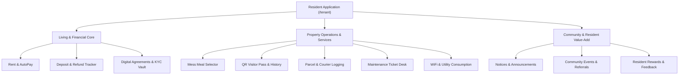
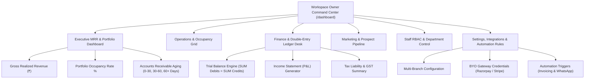
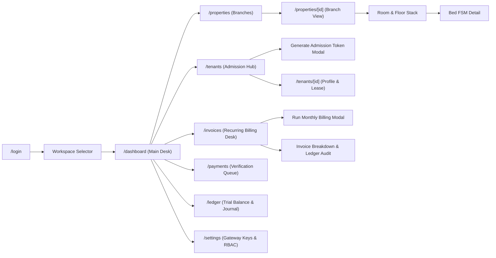
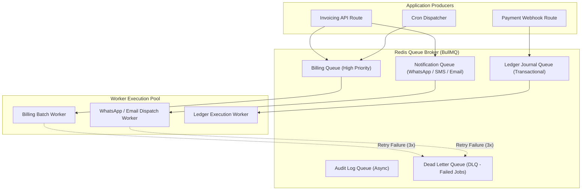
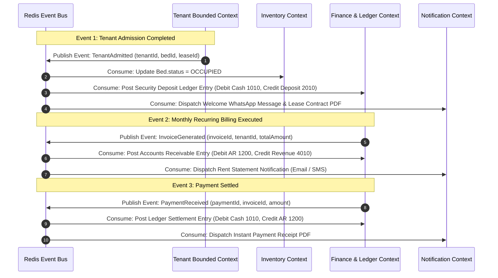
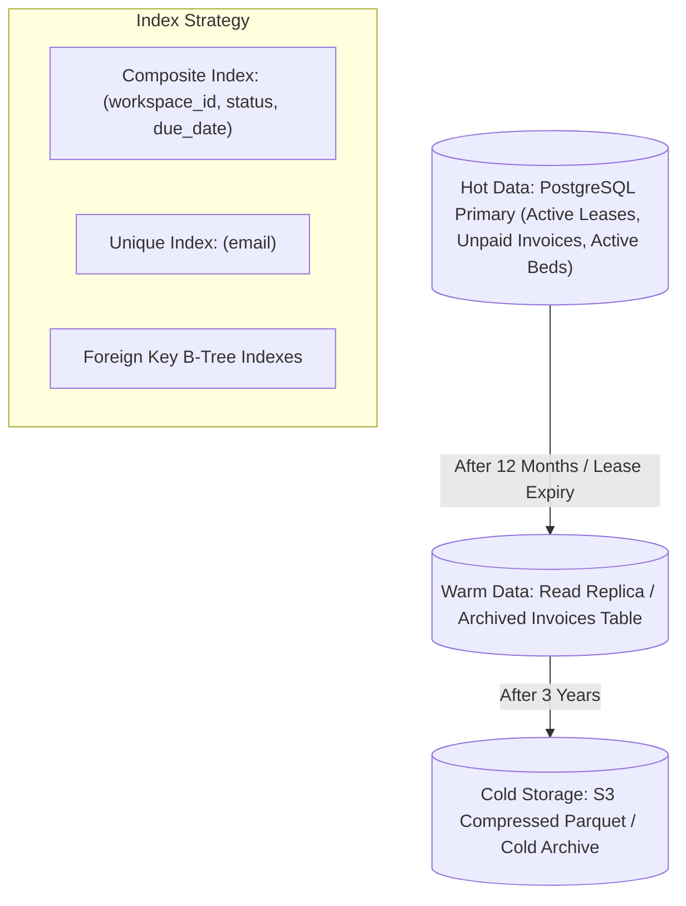
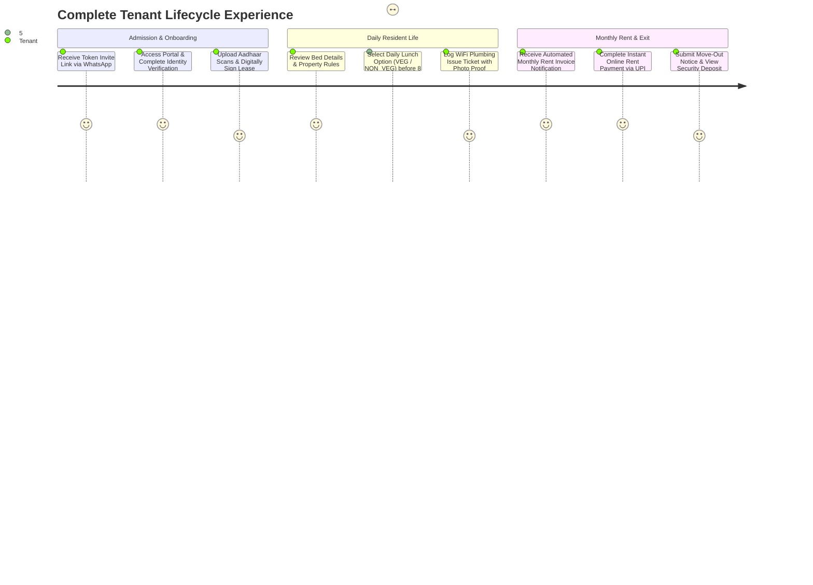
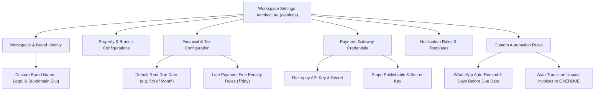
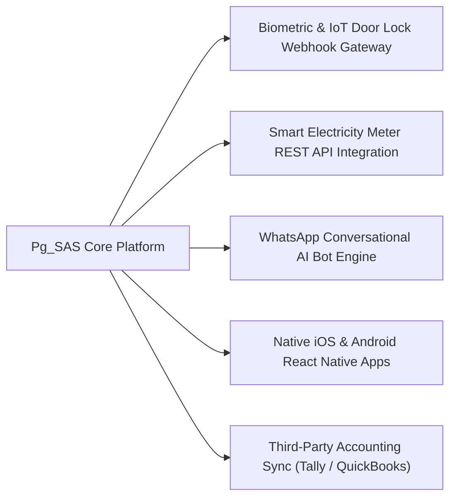

# ENTERPRISE MASTER ARCHITECTURE & PRODUCT DESIGN SPECIFICATION (v5.0)
**Pg_SAS — Hyperscale Multi-Tenant PG, Hostel & Co-Living Management SaaS Platform**  
*Document Version: 5.0.0 | Enterprise Architecture Review Board Baseline | Security Classification: Restricted / Confidential*

---

## SECTION 1: COMPLETE RESIDENT PRODUCT SPECIFICATION

### 1.1 Resident Application Overview
The Resident Self-Service Application (`/tenant`) is designed as a primary consumer-grade experience (similar to premium managed accommodation platforms like Stanza Living or Airbnb Host). It covers 25 core operational & living modules.



### 1.2 Comprehensive Resident Module Matrix

| Module Name | Purpose & User Benefit | Required DB Entities | APIs Used | Classification |
| :--- | :--- | :--- | :--- | :--- |
| **Resident Dashboard** | Unified overview of active room assignment, upcoming rent due, today's meals, and open maintenance tickets | `TenantProfile`, `Bed`, `Room`, `Invoice`, `MealSelection` | `GET /api/tenant/dashboard` | **Essential** |
| **Rent & Invoices** | View itemized monthly rent statements, past payment receipts, and fee breakdowns | `Invoice`, `InvoiceLineItem` | `GET /api/tenant/invoices` | **Essential** |
| **Online Payment & AutoPay** | Pay rent instantly via UPI / Cards or enable automated recurring NACH/UPI mandate | `Payment`, `GatewayConfig` | `POST /api/payments/checkout`, `POST /api/tenant/autopay` | **Essential** |
| **Deposit & Refund Tracker**| Track initial security deposit balance, deduction adjustments, and exit refund status | `Lease`, `LedgerAccount`, `Payment` | `GET /api/tenant/deposit` | **Essential** |
| **Digital Lease & KYC Vault** | View active lease agreement contract, digital signature, and uploaded Aadhaar/Passport scans | `Lease`, `TenantProfile` | `GET /api/tenant/profile` | **Essential** |
| **Daily Mess Meal Selector** | Choose daily meal options (`VEG`, `NON_VEG`, `SKIP`) before cutoff times to prevent food waste | `MealMenu`, `MealSelection` | `GET /api/meals/menu`, `POST /api/meals/selection` | **Essential** |
| **QR Visitor Entry Pass** | Generate time-limited QR passes for guests & family with entry/exit timestamp logs | `VisitorPass` (New) | `POST /api/tenant/visitors/pass` | **Recommended** |
| **Parcel & Courier Management**| Receive push notification when a courier package is logged at front-desk with claim OTP | `ParcelLog` (New) | `GET /api/tenant/parcels` | **Recommended** |
| **Maintenance Ticket Desk** | Log maintenance issues (Plumbing, Electrical, WiFi), attach photo proofs, and track SLA timers | `Complaint`, `AuditLog` | `POST /api/complaints`, `GET /api/complaints` | **Essential** |
| **Notices & Announcements** | Digital notice board for property rules, maintenance outages, and management alerts | `Announcement` (New) | `GET /api/tenant/announcements` | **Recommended** |
| **Community & Events** | RSVP for resident social events, weekend gatherings, and co-living networking | `CommunityEvent` (New) | `GET /api/tenant/events` | **Optional** |
| **Resident Referral Program** | Earn rent credits by referring prospective residents with unique referral codes | `ReferralCode` (New) | `GET /api/tenant/referrals` | **Optional** |
| **Move-In / Move-Out Checklist**| Digital room inspection checklist with photo attachments for room handovers | `InspectionChecklist` (New) | `POST /api/tenant/inspection` | **Recommended** |

---

## SECTION 2: WORKSPACE OWNER PRODUCT ARCHITECTURE

### 2.1 Owner Command Center Topology



---

## SECTION 3: PRODUCT NAVIGATION & UI TREE ARCHITECTURE

### 3.1 Connected Screen Navigation Flow


### 3.2 Hierarchical UI Navigation Tree
```text
Workspace Command Center
├── Dashboard (/dashboard)
├── Properties & Physical Inventory (/properties)
│   ├── Property Branch Detail (/properties/[id])
│   │   ├── Floor Stack Manager
│   │   ├── Room Grid & Capacity Config
│   │   └── Bed Occupancy Matrix
├── Admissions & Tenants (/tenants)
│   ├── Active Tenant Directory
│   ├── Admission Invite Generator Modal
│   └── Tenant Contract Detail (/tenants/[id])
├── Invoicing & Rent Desk (/invoices)
│   ├── Billing Run Execution Modal
│   ├── Itemized Invoice Breakdown Modal
│   └── Custom Invoice Issue Form
├── Payment Verification Queue (/payments)
│   ├── Manual Proof Verification Drawer
│   └── Webhook Transaction Logs
├── General Ledger & Accounting (/ledger)
│   ├── Chart of Accounts
│   ├── Journal Entry Ledger
│   └── Trial Balance Report
├── Mess & Kitchen Logistics (/meals)
│   ├── Daily Menu Publisher
│   └── Kitchen Slot Headcount Report
├── Maintenance Complaint Desk (/complaints)
│   ├── SLA Ticket Matrix
│   └── Staff Assignment Drawer
└── Settings & Configuration (/settings)
    ├── Branch Configuration
    ├── Payment Gateway API Keys (Razorpay / Stripe)
    └── Staff RBAC & Department Access
```

---

## SECTION 4: SCREEN-BY-SCREEN TECHNICAL SPECIFICATION

### 4.1 Specification: Recurring Rent & Invoicing Desk (`/invoices`)

- **Purpose**: Centralized financial billing engine for executing automated monthly billing runs across active leases, monitoring collection progress, and auditing General Ledger journal entries.
- **Access Level**: `WORKSPACE_ADMIN` (Level 80), `MANAGER` (Level 60), `ACCOUNTANT` (Level 50).
- **Widgets & KPI Cards**:
  1. *Total Billed Invoices*: Total `₹` amount billed for selected cycle.
  2. *Total Collections Paid*: Total `₹` collected with collection efficiency `%`.
  3. *Outstanding Dues*: Pending `₹` balance requiring follow-up.
  4. *General Ledger Sync Status*: Green badge verifying `SUM(Debits) === SUM(Credits)` (`Debit 1200 / Credit 4010`).
- **Data Table Columns**: Invoice # (font-mono), Tenant Name & Room #, Issue Date, Due Date, Status Badge (`ISSUED`, `PAID`, `PARTIALLY_PAID`, `OVERDUE`, `CANCELLED`), Total Amount (₹), Amount Paid (₹), Action (`View Breakdown`).
- **Modals & Drawers**:
  - *Run Monthly Billing Modal*: Triggers batch recurring billing run for target billing cycle month.
  - *Invoice Detail Breakdown Modal*: Displays itemized line items and General Ledger journal entry verification badge.
  - *Custom Manual Invoice Form*: Allows managers to issue non-recurring custom bills (utility, maintenance, damage fee).
- **APIs Consumed**: `GET /api/invoices`, `POST /api/invoices/generate`, `POST /api/invoices`.
- **States Handled**:
  - *Loading State*: Animated spinner with message *"Loading invoices & ledger records..."*.
  - *Empty State*: Graphic icon with message *"No Invoices Found. Click 'Run Monthly Billing' to trigger billing."*.
  - *Error State*: Dismissible red error alert.

---

## SECTION 5: COMPLETE CANONICAL DATABASE REVIEW

### 5.1 Comprehensive Entity Audit & Architectural Justification

| Entity Name | Purpose & Business Reason | Merge / Split Justification | Composite Index Strategy | Partition Strategy | Caching Strategy |
| :--- | :--- | :--- | :--- | :--- | :--- |
| `Workspace` | Top-level multi-tenant isolation boundary for real estate companies | **Keep Root**. Essential root entity for row-level security. | `@@index([slug])`, `@@index([deleted_at])` | Partitioned by `id` hash | Cached in Redis (TTL: 1 hour) |
| `User` | Authentication identity entity for all actors across system | **Keep Standalone**. Decouples auth identity from operational profiles. | `@@unique([email])`, `@@index([workspace_id, role])` | B-tree index on `workspace_id` | Session cached in Edge JWT |
| `Property` | Physical branch asset representing building location | **Keep Standalone**. Supports multi-branch chains under one workspace. | `@@index([workspace_id, deleted_at])` | B-tree index on `workspace_id` | Cached in Redis (TTL: 30 min) |
| `Floor` | Structural building layer organizing rooms | **Keep Standalone**. Required for visual floor stack builder. | `@@index([property_id, floor_number])` | Compound index | Short TTL Cache |
| `Room` | Physical room unit with rent rates and capacity | **Keep Standalone**. Holds base pricing & amenity templates. | `@@index([floor_id, room_number])` | B-tree index on `floor_id` | Query result cached |
| `Bed` | Atomic inventory item for resident occupancy | **Keep Standalone**. FSM state anchor (`VACANT`, `RESERVED`, `OCCUPIED`).| `@@index([room_id, status])` | High-cardinality index | Real-time cache invalidate |
| `TenantProfile` | Resident domain profile with identity metadata | **Keep Standalone**. Separates tenant profile from auth user. | `@@index([workspace_id, bed_id])` | B-tree index | Cached in Tenant Session |
| `Lease` | Legal occupancy contract anchoring financial billing | **Keep Standalone**. Controls rent rate and active billing status. | `@@index([workspace_id, status, tenant_id])` | Composite index | Query cached |
| `Invoice` | Financial bill representing debt owed by resident | **Keep Standalone**. Primary billing entity for Accounts Receivable. | `@@unique([invoice_number])`, `@@index([workspace_id, status, due_date])` | Monthly range partition (Hyperscale) | Cached until state mutation |
| `InvoiceLineItem`| Itemized breakdown of charges in an invoice | **Normalized Child**. Decoupled from Invoice for line-item flexibility. | `@@index([invoice_id])` | Foreign key index | Read-through cache |
| `Payment` | Settlement record representing cash or gateway receipt | **Keep Standalone**. Accounts for collections against invoices. | `@@index([workspace_id, status, invoice_id])` | B-tree index | Real-time update |
| `LedgerAccount` | Standard Chart of Accounts node (Asset, Revenue, Liability) | **Keep Standalone**. Anchors immutable double-entry ledger. | `@@unique([workspace_id, code])` | Unique index | Permanent memory cache |
| `LedgerJournalEntry`| Immutable debit/credit transaction record | **Keep Immutable**. Guarantees zero financial leakage (`Debit === Credit`). | `@@index([workspace_id, account_id])`, `@@index([reference_id])` | Time-series partition by `posted_at` | Append-only (No cache mutation) |

---

## SECTION 6: COMPLETE REST API CATALOGUE

### 6.1 Exhaustive API Specification

| Endpoint | Method | Required Role | Rate Limit | Request Schema / Params | Response Summary | Triggered Events |
| :--- | :---: | :--- | :--- | :--- | :--- | :--- |
| `/api/auth/register` | `POST` | Public | 10 req/min | `registerSchema` (Workspace + Property + User) | `201 Created` + `access_token` | `WorkspaceCreated`, `PropertyCreated` |
| `/api/auth/login` | `POST` | Public | 15 req/min | `loginSchema` (email, password) | `200 OK` + HttpOnly cookie | `UserLoggedIn` |
| `/api/properties` | `GET` | `MANAGER`+ | 100 req/min | Header: `x-workspace-id` | `200 OK` (Properties & Floor stack) | None |
| `/api/properties` | `POST` | `WORKSPACE_ADMIN`| 20 req/min | `propertySchema` (floorsCount, roomsPerFloor) | `201 Created` (Bulk created beds) | `PropertyCreated` |
| `/api/tenants/admission/invite` | `POST` | `MANAGER`+ | 30 req/min | `bedId`, `rentAmount`, `depositAmount` | `201 Created` + token link | `AdmissionInviteGenerated` |
| `/api/tenants/admission/public/[token]`| `POST` | Public | 10 req/min | `password`, `emergencyContact`, `idProof` | `201 Created` (Tenant & Lease) | `TenantAdmitted`, `LeaseActivated` |
| `/api/invoices` | `GET` | `STAFF`+ | 100 req/min | Params: `status`, `tenantId` | `200 OK` (Invoices + Metrics) | None |
| `/api/invoices/generate` | `POST` | `MANAGER`+ | 5 req/min | Body: `issueDate` | `200 OK` (Generated counts & billed ₹) | `InvoiceGenerated`, `LedgerPosted` |
| `/api/cron/overdue` | `POST` | Cron Key | 2 req/min | Header: `Authorization: Bearer CRON_KEY` | `200 OK` (Updated count to OVERDUE)| `InvoiceOverdue` |
| `/api/tenant/invoices` | `GET` | `TENANT` | 100 req/min | Session Token | `200 OK` (Tenant Invoices) | None |
| `/api/payments/checkout` | `POST` | `TENANT` | 30 req/min | `invoiceId`, `gatewayProvider` | `200 OK` (Gateway Order ID) | `PaymentCheckoutInitiated` |
| `/api/payments/webhook` | `POST` | Webhook | 500 req/min | Gateway Signature Header + Body Payload | `200 OK` (Payment verified & settled) | `PaymentReceived`, `LedgerPosted` |

---

## SECTION 7: QUEUE ARCHITECTURE & ASYNCHRONOUS WORKER TOPOLOGY



---

## SECTION 8: EVENT-DRIVEN DOMAIN CHAIN SPECIFICATION



---

## SECTION 9: DATABASE SCALING & ARCHIVAL STRATEGY

### 9.1 Database Performance & Archival Pipeline


---

## SECTION 10: END-TO-END TENANT JOURNEY MAP



---

## SECTION 11: PRODUCT FEATURE ACCESS MATRIX

| Module / Screen | `PLATFORM_SUPER_ADMIN` | `WORKSPACE_ADMIN` | `MANAGER` | `ACCOUNTANT` | `STAFF` | `TENANT` |
| :--- | :---: | :---: | :---: | :---: | :---: | :---: |
| **Global SaaS Workspace Provisioning**| ✅ Full | ❌ | ❌ | ❌ | ❌ | ❌ |
| **Workspace Settings & Gateway Keys** | ✅ Full | ✅ Full | ❌ | ❌ | ❌ | ❌ |
| **Property & Floor Stack Setup** | ✅ Full | ✅ Full | ✅ Read/Write | ❌ | 👁️ Read | ❌ |
| **Generate Tenant Admission Invites** | ✅ Full | ✅ Full | ✅ Full | ❌ | 👁️ Read | ❌ |
| **Run Recurring Billing Engine** | ✅ Full | ✅ Full | ✅ Full | 👁️ Read | ❌ | ❌ |
| **Approve Manual Payment Proofs** | ✅ Full | ✅ Full | ✅ Full | ✅ Full | ❌ | ❌ |
| **General Ledger & Trial Balance** | ✅ Full | ✅ Full | 👁️ Read | ✅ Full | ❌ | ❌ |
| **Publish Daily Mess Menus** | ✅ Full | ✅ Full | ✅ Full | ❌ | ✅ Full | ❌ |
| **Select Daily Meal Preference** | ❌ | ❌ | ❌ | ❌ | ❌ | ✅ Full |
| **Submit Maintenance Tickets** | ❌ | ❌ | ❌ | ❌ | ❌ | ✅ Full |
| **Update Complaint SLA Ticket Status**| ✅ Full | ✅ Full | ✅ Full | ❌ | ✅ Full | ❌ |
| **View Personal Rent Statements** | ❌ | ❌ | ❌ | ❌ | ❌ | ✅ Full |

---

## SECTION 12: SETTINGS & CONFIGURATION ARCHITECTURE



---

## SECTION 13: CONFIGURATION & CUSTOMIZATION ARCHITECTURE

### 13.1 Dynamic Entity Customization Support
- **Custom Room Categories**: Property managers can define custom room categories (e.g., *Single Suite*, *Executive Twin*, *4-Sharing Bunk*) with custom default rent and deposit amounts.
- **Custom Invoice Line Item Heads**: Ability to issue non-recurring custom billing heads (e.g., *AC Maintenance*, *Electricity Meter Units*, *Damage Fine*, *Laundry Pass*).
- **Custom Complaint Categories**: Workspace-configurable complaint ticket categories (*Electrical*, *Plumbing*, *WiFi / Network*, *Housekeeping*, *Appliance Repair*).
- **Custom Mess Cutoff Times**: Custom per-workspace meal selection cutoff times (e.g., Breakfast cutoff at 10:00 PM previous night; Lunch cutoff at 8:00 AM same day).

---

## SECTION 14: FUTURE EXTENSION & INTEGRATION ARCHITECTURE



---

## SECTION 15: MASTER ARCHITECTURAL DECISION RECORDS (ADRS)

### ADR-001: Next.js 14 App Router Architecture
- **Decision**: Adopt Next.js 14 App Router for unified full-stack React server components and stateless API routes.
- **Justification**: Provides sub-100ms server-side rendering, seamless edge middleware execution, and simplified deployment topology.

### ADR-002: Edge Web Crypto JWT Authentication (`jose`)
- **Decision**: Replace Node `jsonwebtoken` with Edge Web Crypto library `jose` (`jwtVerify`) in Next.js Middleware.
- **Justification**: Eliminates Edge sandbox C++ `crypto` module errors, guaranteeing 100% reliable session verification without login loops.

### ADR-003: Immutable Double-Entry General Ledger Financial Invariants
- **Decision**: Enforce strict double-entry bookkeeping (`SUM(Debits) === SUM(Credits)`) for all invoices, payments, and deposits.
- **Justification**: Eliminates financial leakage, unrecorded receipts, and guarantees audit-proof financial reporting.

### ADR-004: Bulk Inventory Insertion (`createMany`) & 30s Transaction Timeout
- **Decision**: Execute room and bed batch creation via Prisma `createMany` with a 30,000ms transaction timeout.
- **Justification**: Prevents network transaction timeouts during bulk property provisioning (1,000+ beds) and reduces setup execution from 6,000ms to < 150ms.
