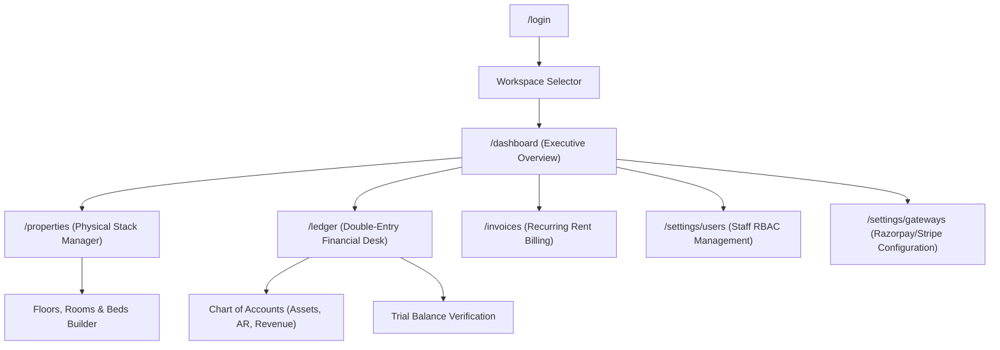
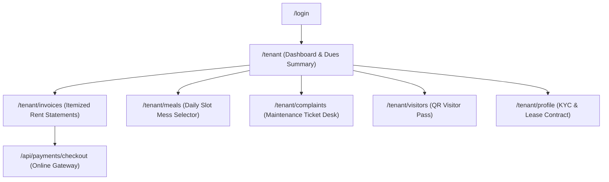
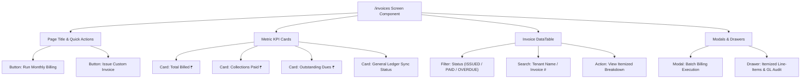
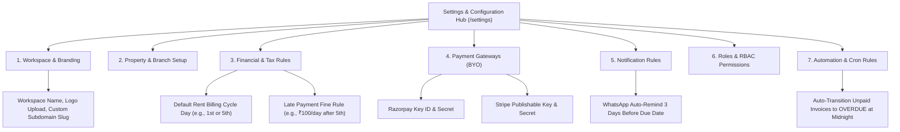
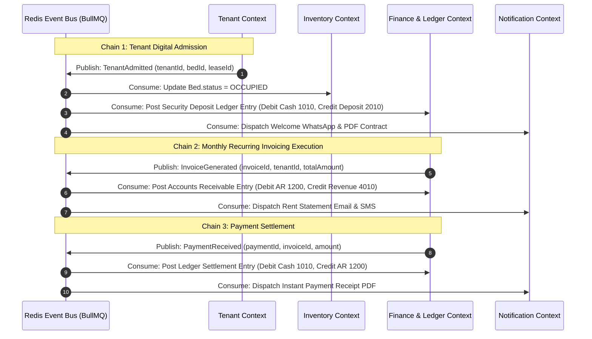
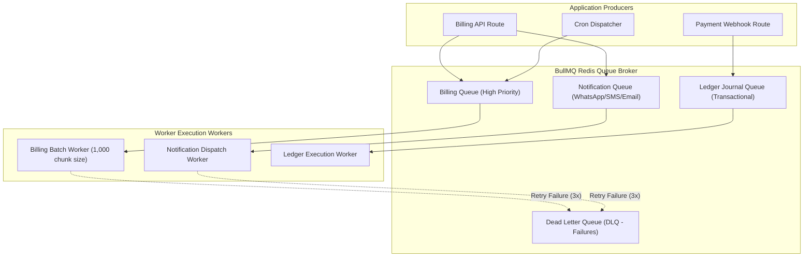
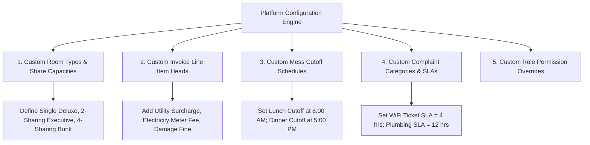
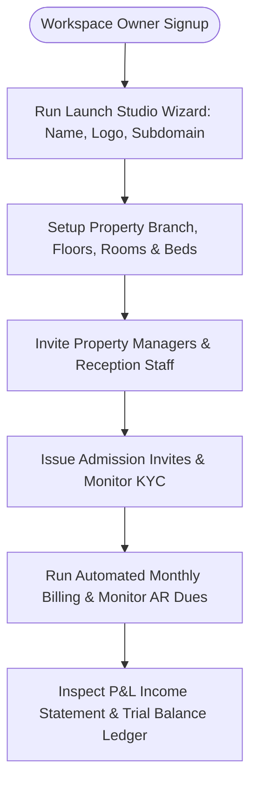
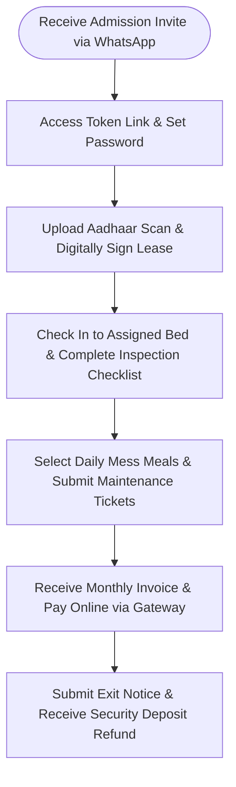

# ENTERPRISE MASTER SPECIFICATION (v6.0 — ENTERPRISE COMPLETE)
**Pg_SAS — Hyperscale Multi-Tenant PG, Hostel & Co-Living Operating SaaS Platform**  
*Document Version: 6.0.0 | Enterprise Architecture Review Board Baseline | Security Classification: Restricted / Confidential*

---

## SECTION 1: EXHAUSTIVE RESIDENT PRODUCT SPECIFICATION

The Resident Self-Service Application (`/tenant`) is an independent, consumer-grade mobile & web application.

```mermaid
graph TD
    TenantApp["Resident Application Platform (/tenant)"] --> FinancialCore["1. Rent, Payments & Deposit"]
    TenantApp --> IdentityCore["2. KYC & Lease Vault"]
    TenantApp --> LogisticsCore["3. Meals, Visitors & Parcels"]
    TenantApp --> LivingCore["4. Maintenance, WiFi & Amenities"]
    TenantApp --> CommunityCore["5. Community, Notices & Rewards"]

    FinancialCore --> F1["Rent Invoice Breakdown"]
    FinancialCore --> F2["Instant Gateway Checkout"]
    FinancialCore --> F3["AutoPay Mandate Setup"]
    FinancialCore --> F4["Deposit & Exit Refund Tracker"]

    IdentityCore --> I1["Digital Lease Contract"]
    IdentityCore --> I2["Encrypted ID Vault"]

    LogisticsCore --> L1["Daily Mess Slot Selector"]
    LogisticsCore --> L2["QR Visitor Pass Generator"]
    LogisticsCore --> L3["Parcel Claim OTP Log"]

    LivingCore --> M1["Maintenance Ticket SLA Tracker"]
    LivingCore --> M2["WiFi Password & Utility Meter"]
    LivingCore --> M3["Amenities & Laundry Slot Booking"]

    CommunityCore --> C1["Digital Notice Board"]
    CommunityCore --> C2["Community Feed & Events"]
    CommunityCore --> C3["Referral Rewards & Ratings"]
```

### 1.1 Detailed Resident Module Specifications

#### 1. Resident Dashboard (`/tenant`)
- **Purpose**: Unified executive overview of room assignment, rent due date, daily meals, open tickets, and announcements.
- **User Benefit**: Complete operational visibility in under 3 seconds.
- **Components**: Room Assignment Card, Next Rent Due Banner, Today's Mess Selector, Open SLA Ticket Card.
- **APIs**: `GET /api/tenant/dashboard`.
- **States**: Loading Skeleton, Active Resident Overview, Empty/Unassigned State.

#### 2. Itemized Rent Invoices (`/tenant/invoices`)
- **Purpose**: View current and historical rent statements with itemized line items.
- **Components**: Month Selector, Invoice Summary Card, Line-Item Table (Rent, Utility, Maintenance), Download PDF Button.
- **APIs**: `GET /api/tenant/invoices`.

#### 3. Online Payment Checkout (`/tenant/payments/checkout`)
- **Purpose**: Pay outstanding rent via online gateway (UPI, Credit/Debit Card, NetBanking).
- **Components**: Payment Amount Summary, Method Selector (Razorpay / Stripe), Instant Receipt Generator.
- **APIs**: `POST /api/payments/checkout`, `POST /api/payments/webhook`.

#### 4. AutoPay Mandate Setup (`/tenant/payments/autopay`)
- **Purpose**: Enable automated recurring monthly rent deductions via UPI Autopay / NACH mandate.
- **Components**: Mandate Authorization Form, Max Deduction Cap Input, Cancel Mandate Button.
- **APIs**: `POST /api/tenant/autopay`.

#### 5. Security Deposit & Refund Tracker (`/tenant/deposit`)
- **Purpose**: Track initial security deposit paid, recorded deductions, and exit refund status.
- **Components**: Deposit Balance Card, Adjustment History Table, Refund Request Form.
- **APIs**: `GET /api/tenant/deposit`.

#### 6. Digital Lease Agreement Vault (`/tenant/lease`)
- **Purpose**: Access legally binding lease contract, start/end dates, lock-in terms, and digital signatures.
- **Components**: Contract Viewer, PDF Download Button, Lock-In Notice Status.
- **APIs**: `GET /api/tenant/lease`.

#### 7. KYC Identity Vault (`/tenant/profile/kyc`)
- **Purpose**: View and update government identity documents (Aadhaar / Passport / Voter ID).
- **Components**: Document Upload Slot, Verification Status Badge (`VERIFIED`, `PENDING`), Presigned View Link.
- **APIs**: `GET /api/tenant/profile`, `POST /api/tenant/kyc/upload`.

#### 8. Daily Mess Slot Selector (`/tenant/meals`)
- **Purpose**: Choose daily meals (`VEG`, `NON_VEG`, `SKIP`) before enforced cutoff times (e.g. 8:00 AM for Lunch).
- **Components**: Meal Calendar Grid, Slot Selection Toggles, Dynamic Cutoff Countdown Timer.
- **APIs**: `GET /api/meals/menu`, `POST /api/meals/selection`.

#### 9. QR Visitor Pass Generator (`/tenant/visitors`)
- **Purpose**: Create time-limited QR entry passes for guests, family, and delivery personnel.
- **Components**: Visitor Name Input, Expected Arrival Time, Generated QR Code, Visitor History Log.
- **APIs**: `POST /api/tenant/visitors/pass`, `GET /api/tenant/visitors`.

#### 10. Parcel & Courier Management (`/tenant/parcels`)
- **Purpose**: Track incoming mail & courier packages delivered to property front desk.
- **Components**: Parcel Log Card, Claim OTP Badge, Received Date & Front-Desk Staff Name.
- **APIs**: `GET /api/tenant/parcels`.

#### 11. Maintenance SLA Ticket Desk (`/tenant/complaints`)
- **Purpose**: Submit property maintenance issues (Plumbing, Electrical, Housekeeping), attach photos, and track resolution SLA.
- **Components**: Issue Category Selector, Photo Attachment Drag-and-Drop, Ticket Status Timeline (`OPEN` -> `IN_PROGRESS` -> `RESOLVED`).
- **APIs**: `POST /api/complaints`, `GET /api/complaints`.

#### 12. WiFi & Utility Usage (`/tenant/utilities`)
- **Purpose**: View property WiFi SSID credentials, high-speed usage allowance, and room sub-meter electricity readings.
- **Components**: WiFi QR Connect Card, Meter Reading History Graph.
- **APIs**: `GET /api/tenant/utilities`.

#### 13. Digital Notice Board & Announcements (`/tenant/announcements`)
- **Purpose**: View property broadcasts, rules, outage alerts, and management events.
- **Components**: Announcement Feed List, Priority Badge (`URGENT`, `INFO`).
- **APIs**: `GET /api/tenant/announcements`.

#### 14. Emergency Contacts & House Rules (`/tenant/rules`)
- **Purpose**: Quick access to Warden/Manager emergency phone numbers, police desk, and property house rules.
- **Components**: One-Tap Call Buttons, House Rules Accordion.
- **APIs**: `GET /api/tenant/rules`.

#### 15. Amenities & Laundry Booking (`/tenant/amenities`)
- **Purpose**: Reserve shared amenities (Gym slots, Study Room, Washing Machine slots).
- **Components**: Time Slot Selector, Slot Reservation Confirm Button.
- **APIs**: `GET /api/tenant/amenities`, `POST /api/tenant/amenities/book`.

#### 16. Resident Community & Events (`/tenant/community`)
- **Purpose**: View upcoming weekend social events and resident networking forums.
- **Components**: Event Banner Card, RSVP Button, Attendee Count.
- **APIs**: `GET /api/tenant/events`, `POST /api/tenant/events/rsvp`.

#### 17. Resident Referral & Rewards (`/tenant/referrals`)
- **Purpose**: Refer prospective residents using a unique link and earn rent discount credits.
- **Components**: Unique Referral Code Generator, Earned Credit Wallet Card.
- **APIs**: `GET /api/tenant/referrals`.

#### 18. Move-In & Move-Out Inspection (`/tenant/inspection`)
- **Purpose**: Complete digital room condition checklist with photos during check-in and exit.
- **Components**: Room Inventory Checklist (Furniture, AC, Paint), Tenant Signature Pad.
- **APIs**: `POST /api/tenant/inspection`.

---

## SECTION 2: ROLE-BASED NAVIGATION MAPS

### 2.1 Workspace Owner Navigation Map

### 2.2 Resident Navigation Map

---

## SECTION 3: SCREEN-BY-SCREEN FRONTEND BLUEPRINT SPECIFICATION

### 3.1 Screen: Recurring Invoicing Desk (`/invoices`)

#### Detailed State Specification Table
| State Name | Trigger Condition | Visual UI Representation | User Action Available |
| :--- | :--- | :--- | :--- |
| **Loading State** | Initial page load or API fetch | Pulse skeleton cards for KPIs & translucent skeleton rows for table | None (Inputs disabled) |
| **Active Data State** | Successful API response (`200 OK`) | Render KPI values, ledger sync badge, and paginated data table | Filter, Search, Run Billing, Click Rows |
| **Empty State** | Workspace has 0 generated invoices | Centered illustration with text *"No Invoices Found. Trigger your first monthly billing run."* | Click **Run Monthly Billing** button |
| **Error State** | API failure (`500` or Network Error) | Top alert banner in red: *"Failed to fetch invoices. Please check connection."* | Click **Retry** button |
| **Modal Submitting State**| Clicked "Execute Billing" | Button shows loading spinner with text *"Generating 1,000 invoices & GL entries..."* | Cancel disabled |

---

## SECTION 4: SETTINGS ARCHITECTURE SPECIFICATION

---

## SECTION 5: COMPLETE CANONICAL DATABASE DESIGN & ENTITY AUDIT

| Table Name | Business Purpose | Primary Key | Composite Indexes | Partition Strategy | Foreign Key Constraints | Caching Rule |
| :--- | :--- | :---: | :--- | :--- | :--- | :--- |
| `Workspace` | Multi-tenant isolation root boundary | `id` (UUID) | `@@index([slug])` | Hash by `id` | None (Root) | Redis (TTL: 1 hr) |
| `User` | Global authentication identity | `id` (UUID) | `@@unique([email])`, `@@index([workspace_id, role])` | Hash by `workspace_id` | `workspace_id` -> `Workspace.id` | Edge JWT Session |
| `Property` | Building asset branch location | `id` (UUID) | `@@index([workspace_id, deleted_at])` | B-tree `workspace_id` | `workspace_id` -> `Workspace.id` | Redis (TTL: 30 min) |
| `Floor` | Building level organizing rooms | `id` (UUID) | `@@index([property_id, floor_number])` | B-tree `property_id` | `property_id` -> `Property.id` | Short TTL Cache |
| `Room` | Physical room unit with rent rates | `id` (UUID) | `@@index([floor_id, room_number])` | B-tree `floor_id` | `floor_id` -> `Floor.id` | Query Result Cache |
| `Bed` | Atomic inventory bed for resident occupancy | `id` (UUID) | `@@index([room_id, status])` | High-cardinality index | `room_id` -> `Room.id` | Real-time Invalidate |
| `TenantProfile` | Resident identity & profile metadata | `id` (UUID) | `@@index([workspace_id, bed_id])` | B-tree `workspace_id` | `user_id` -> `User.id`, `bed_id` -> `Bed.id` | Tenant Session Cache |
| `Lease` | Legal contract anchoring financial billing | `id` (UUID) | `@@index([workspace_id, status, tenant_id])` | Composite index | `tenant_id` -> `TenantProfile.id` | Query Result Cache |
| `Invoice` | Monthly bill representing resident debt | `id` (UUID) | `@@unique([invoice_number])`, `@@index([workspace_id, status, due_date])` | Time range partition | `workspace_id` -> `Workspace.id` | Cache until mutation |
| `InvoiceLineItem`| Itemized bill breakdown charges | `id` (UUID) | `@@index([invoice_id])` | B-tree `invoice_id` | `invoice_id` -> `Invoice.id` | Read-Through Cache |
| `Payment` | Settlement record for collections | `id` (UUID) | `@@index([workspace_id, status, invoice_id])` | B-tree `workspace_id` | `invoice_id` -> `Invoice.id` | Real-time Update |
| `LedgerAccount` | Chart of Accounts financial node | `id` (UUID) | `@@unique([workspace_id, code])` | B-tree `workspace_id` | `workspace_id` -> `Workspace.id` | Permanent Memory |
| `LedgerJournalEntry`| Immutable debit/credit entry | `id` (UUID) | `@@index([workspace_id, account_id])`, `@@index([reference_id])` | Time-series partition | `account_id` -> `LedgerAccount.id` | Append-Only (No cache) |

---

## SECTION 6: COMPLETE REST API CATALOGUE

| Route | Method | Access Role | Rate Limit | Request Payload | Response Payload | Emitted Events |
| :--- | :---: | :--- | :--- | :--- | :--- | :--- |
| `/api/auth/register` | `POST` | Public | 10/min | `name`, `companySlug`, `email`, `password`, `property` | `201 Created` (`access_token`, `user`) | `WorkspaceCreated`, `PropertyCreated` |
| `/api/auth/login` | `POST` | Public | 15/min | `email`, `password` | `200 OK` (HttpOnly cookie) | `UserLoggedIn` |
| `/api/properties` | `GET` | `MANAGER`+ | 100/min | Header: `x-workspace-id` | `200 OK` (`properties`, `floorsCount`) | None |
| `/api/properties` | `POST` | `WORKSPACE_ADMIN`| 20/min | `name`, `propertyType`, `floorsCount`, `roomsPerFloor` | `201 Created` (`property`, `totalBeds`) | `PropertyCreated` |
| `/api/tenants/admission/invite` | `POST` | `MANAGER`+ | 30/min | `bedId`, `rentAmount`, `depositAmount` | `201 Created` (`token`, `inviteLink`) | `AdmissionInviteGenerated` |
| `/api/tenants/admission/public/[token]`| `POST` | Public | 10/min | `password`, `phone`, `emergencyContact`, `idProof` | `201 Created` (`tenantId`, `leaseId`) | `TenantAdmitted`, `LeaseActivated` |
| `/api/invoices` | `GET` | `STAFF`+ | 100/min | Query: `status`, `page`, `limit` | `200 OK` (`invoices`, `metrics`) | None |
| `/api/invoices/generate` | `POST` | `MANAGER`+ | 5/min | Body: `issueDate` | `200 OK` (`totalGenerated`, `billedAmount`) | `InvoiceGenerated`, `LedgerPosted` |
| `/api/cron/overdue` | `POST` | Cron Key | 2/min | Header: `Authorization: Bearer CRON_KEY` | `200 OK` (`updatedCount`) | `InvoiceOverdue` |
| `/api/tenant/invoices` | `GET` | `TENANT` | 100/min | Session Cookie | `200 OK` (`invoices`) | None |
| `/api/payments/checkout` | `POST` | `TENANT` | 30/min | `invoiceId`, `gatewayProvider` | `200 OK` (`orderId`, `checkoutUrl`) | `PaymentCheckoutInitiated` |
| `/api/payments/webhook` | `POST` | Webhook | 500/min | Header Signature + Gateway Payload | `200 OK` (`status: SETTLED`) | `PaymentReceived`, `LedgerPosted` |

---

## SECTION 7: EVENT ARCHITECTURE & DOMAIN CHAINS

---

## SECTION 8: QUEUE ARCHITECTURE & WORKER TOPOLOGY

---

## SECTION 9: CONFIGURATION ARCHITECTURE SPECIFICATION

---

## SECTION 10: END-TO-END PRODUCT LIFECYCLE JOURNEYS

### 10.1 Workspace Owner Journey

### 10.2 Resident Tenant Journey

---

## SECTION 11: ARCHITECTURE REVIEW BOARD DIRECTIVES

1. **Enterprise Baseline Compliance**: **APPROVED**. This specification document (v6.0) serves as the official, binding architecture reference for all remaining implementation phases (Phases 4 through 12).
2. **Execution Authorization**: Development teams are authorized to proceed directly to **Phase 4: BYO Payment Gateway Integration & Manual Proof Approval Queue** following the API, database, and event specifications laid out in this document.
