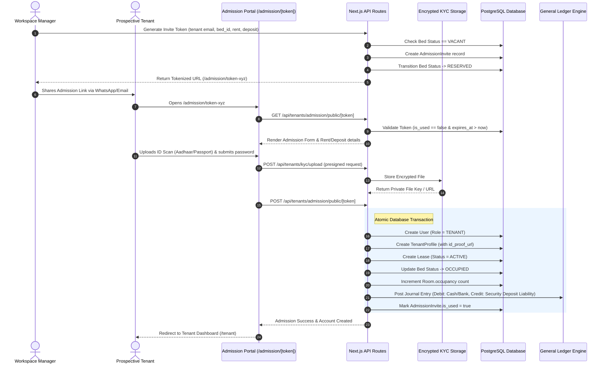
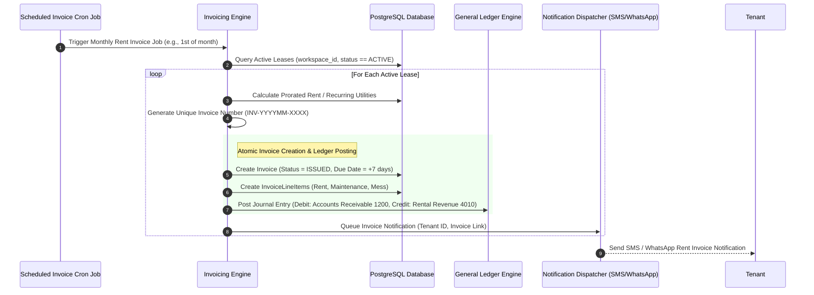
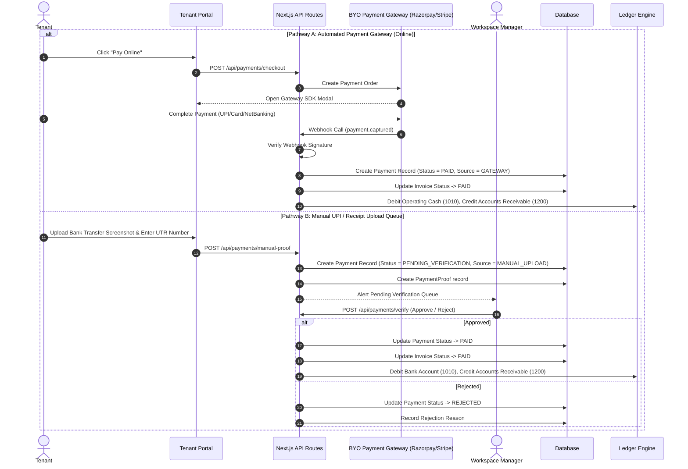
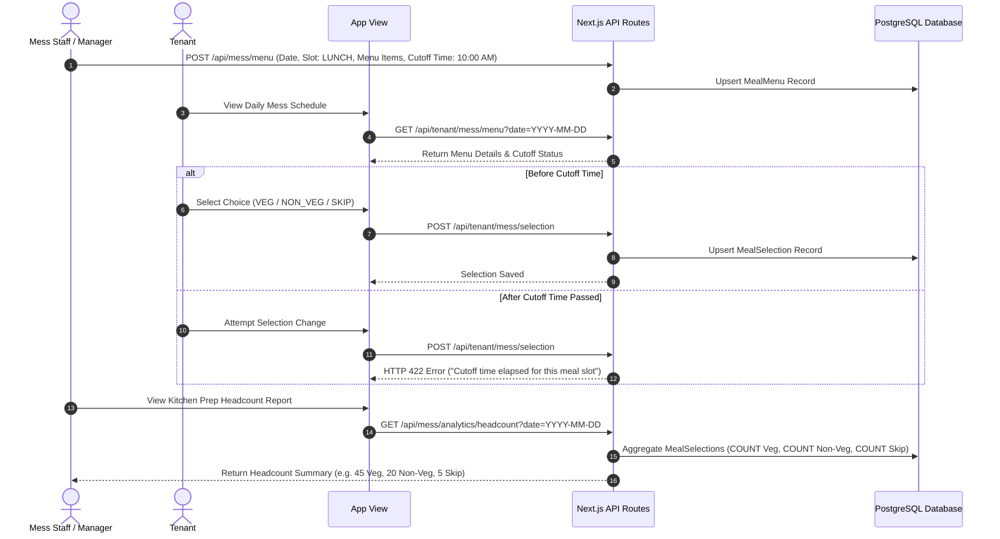
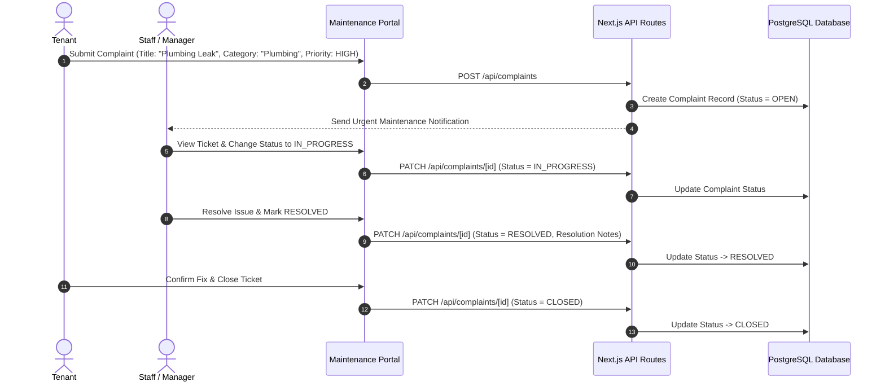

# Feature Flow Handbook
**End-to-End Sequence Diagrams & Business Process Workflows**  
*PG / Hostel Management SaaS Platform (Pg_SAS)*

---

## 1. Overview

This handbook outlines the core end-to-end operational feature workflows of the **Pg_SAS** platform using standard Mermaid sequence diagrams. Each flow documents request sequences, state transitions, validation checks, database transactions, and notifications.

---

## 2. Feature Flow 1: Tenant Admission & Digital KYC Flow

---

## 3. Feature Flow 2: Recurring Rent & Double-Entry Ledger Invoicing Flow

---

## 4. Feature Flow 3: Dual Payment Pathways Flow

---

## 5. Feature Flow 4: Dynamic Slot Meal Selection & Kitchen Headcount Flow

---

## 6. Feature Flow 5: Maintenance Complaint Resolution Flow

