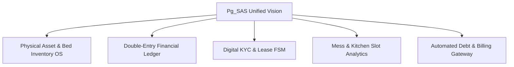
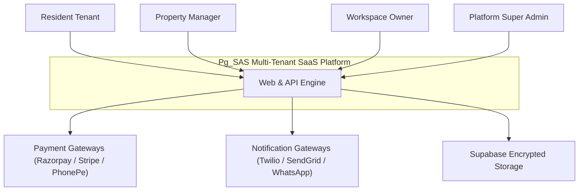
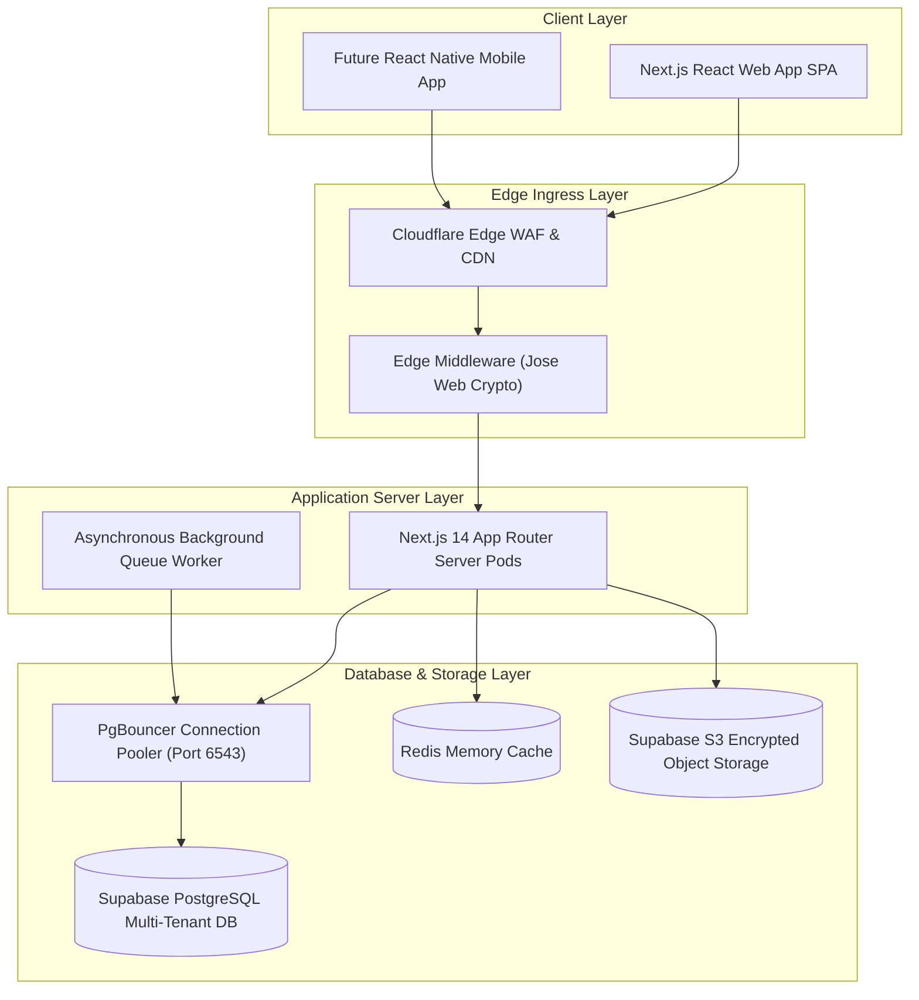
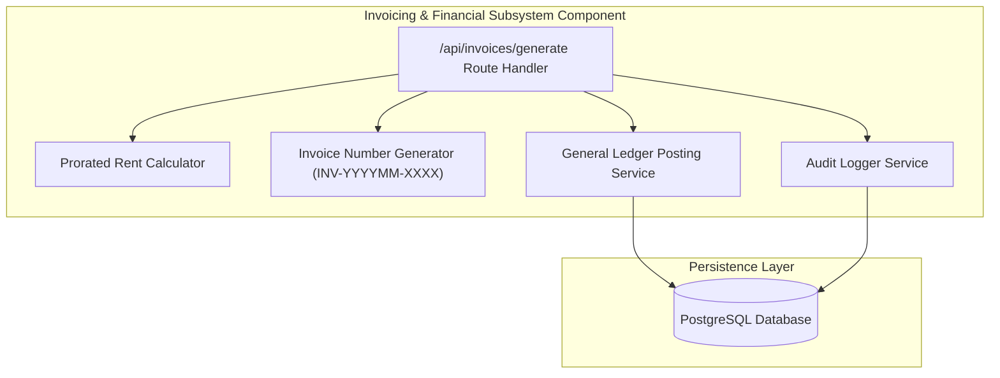
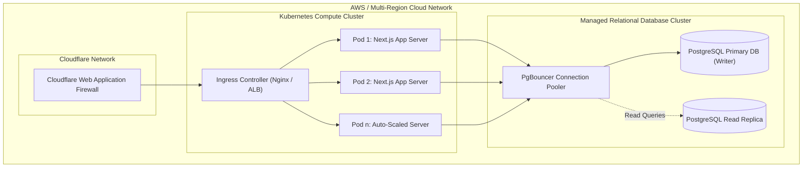
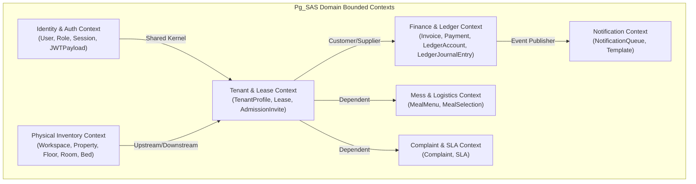
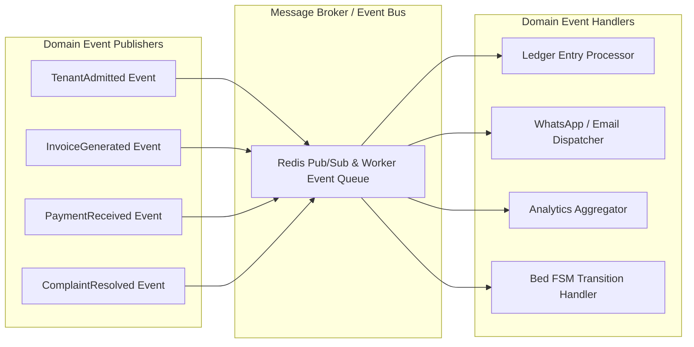
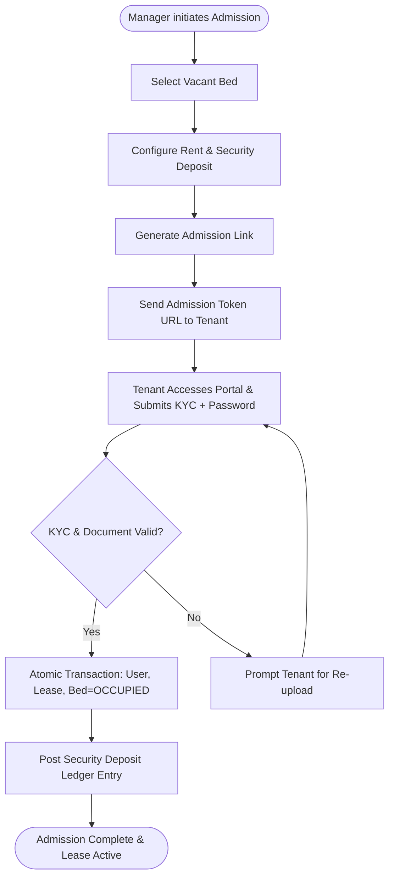
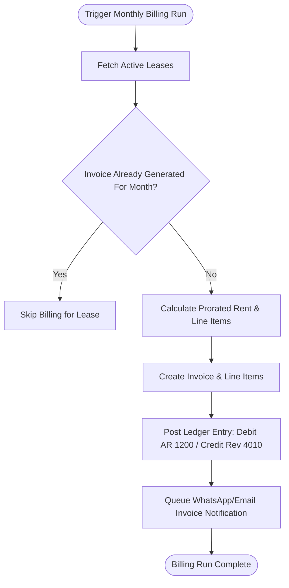
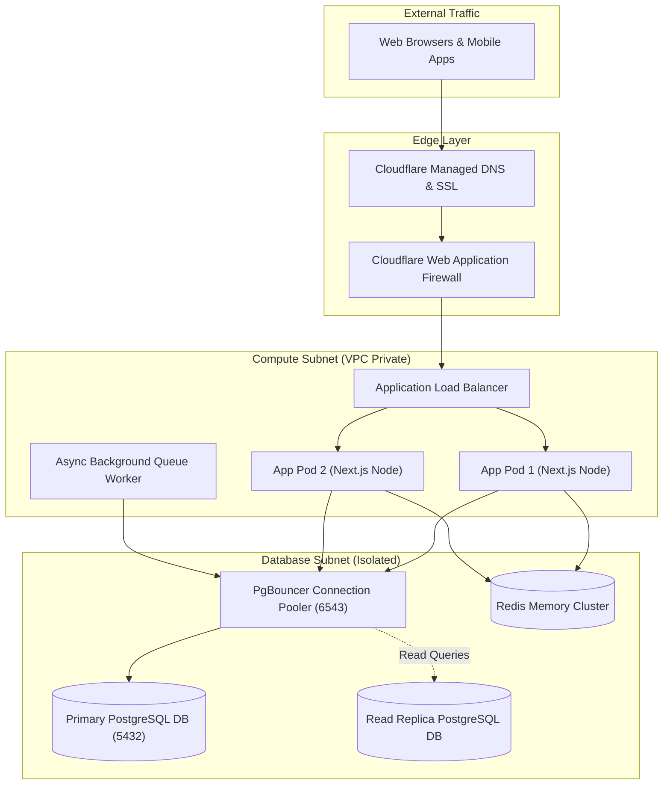

# MASTER ENTERPRISE ARCHITECTURE SPECIFICATION (v3.0)
**PG_SAS — Enterprise Multi-Tenant PG, Hostel & Co-Living Management SaaS Platform**  
*Document Version: 3.0.0 | Security Classification: Restricted / Internal Architecture Baseline*

---

## SECTION 1: EXECUTIVE SUMMARY

### 1.1 Product Vision
**Pg_SAS** is built to be the definitive, enterprise-grade cloud operating system for multi-tenant Student Housing, Paying Guest (PG) Accommodations, Hostels, and Co-Living Real Estate chains. The platform bridges physical asset management with double-entry financial ledger execution, tokenized tenant onboarding, dynamic slot meal logistics, and automated multi-channel debt collection into a unified, high-availability SaaS platform.



### 1.2 Business Goal
To empower single-branch property owners and enterprise hospitality chains (10,000+ beds) with an operational foundation that reduces revenue leakage to **0%**, automates 95% of recurring monthly invoicing, eliminates manual paper KYC compliance, and maintains sub-second operational response times across global property networks.

### 1.3 Problem Statement
The co-living and student housing industry suffers from key structural inefficiencies:
1. **Financial Leakage & Off-Ledger Rent Collection**: Manual cash receipts and unlinked UPI transfers lead to unrecorded security deposits and delayed rent recognition.
2. **Bed Occupancy State Inconsistency**: Disconnects between front-desk bookings, active leases, and actual physical bed occupancy result in double-booking or unmonitored vacancy.
3. **Food Waste & Kitchen Logistics Misalignment**: Fixed meal preparation without dynamic cutoffs leads to massive kitchen cost overruns (25-40% food wastage).
4. **Tenant Onboarding Bottlenecks**: Manual document verification delays admissions, creates regulatory compliance risk, and lacks verifiable digital audit trails.

### 1.4 Target Scale & SLA Targets
| Metric | Year 1 Target | Enterprise Multi-Region Scale | Target SLA / Threshold |
| :--- | :--- | :--- | :--- |
| **Active Workspaces** | 500 Workspaces | 10,000 Workspaces | 99.95% Availability |
| **Total Managed Beds** | 25,000 Beds | 1,000,000 Beds | Instant State FSM Sync |
| **Monthly Invoices Generated** | 25,000 Invoices | 1,000,000 Invoices | < 15 mins for 1M batch |
| **API Latency (p95)** | < 120ms | < 80ms | Global CDN Edge Cached |
| **DB Read/Write Latency** | < 15ms / < 30ms | < 5ms (Read Pool) | Read-replica Routing |

---

## SECTION 2: COMPLETE C4 ARCHITECTURAL MODEL

### 2.1 C4 Level 1: System Context Diagram


### 2.2 C4 Level 2: Container Diagram


### 2.3 C4 Level 3: Component Diagram (Invoicing & Financial Subsystem)


### 2.4 C4 Level 4: Deployment Topology Diagram


---

## SECTION 3: DOMAIN-DRIVEN DESIGN (DDD) CONTEXT MAP



---

## SECTION 4: EVENT ARCHITECTURE & DOMAIN EVENTS



---

## SECTION 5: FINITE STATE MACHINE (FSM) DIAGRAMS

### 5.1 Bed Occupancy State Machine (FSM)
```mermaid
stateDiagram-v8
    [*] --> VACANT : Property Setup
    VACANT --> RESERVED : Admission Invite Generated
    RESERVED --> OCCUPIED : Digital Onboarding Completed
    RESERVED --> VACANT : Invite Cancelled / Token Expired
    OCCUPIED --> MAINTENANCE : Room Damage / Renovation
    MAINTENANCE --> VACANT : Repair Completed
    OCCUPIED --> VACANT : Lease Terminated & Move Out
```

### 5.2 Lease Lifecycle State Machine (FSM)
```mermaid
stateDiagram-v8
    [*] --> PENDING : Token Generated
    PENDING --> ACTIVE : Tenant Onboarded & Lease Signed
    ACTIVE --> NOTICE_PERIOD : Move Out Notice Served
    NOTICE_PERIOD --> TERMINATED : Final Settlement Completed
    ACTIVE --> TERMINATED : Early Termination
    TERMINATED --> [*]
```

### 5.3 Invoice Lifecycle State Machine (FSM)
```mermaid
stateDiagram-v8
    [*] --> DRAFT : Billing Run Initiated
    DRAFT --> ISSUED : Issued to Tenant
    ISSUED --> PARTIALLY_PAID : Partial Payment Received
    ISSUED --> PAID : Full Payment Settled
    PARTIALLY_PAID --> PAID : Remaining Balance Settled
    ISSUED --> OVERDUE : Due Date Passed
    PARTIALLY_PAID --> OVERDUE : Due Date Passed
    OVERDUE --> PAID : Overdue Dues Cleared
    ISSUED --> CANCELLED : Voided by Manager
```

### 5.4 Payment Verification State Machine (FSM)
```mermaid
stateDiagram-v8
    [*] --> PENDING : Payment Submitted / Webhook Received
    PENDING --> VERIFIED : Gateway Signature Verified / Proof Approved
    PENDING --> REJECTED : Manual Proof Rejected / Webhook Failed
    VERIFIED --> SETTLED : Cash/AR Ledger Journal Posted
    SETTLED --> [*]
```

### 5.5 Maintenance Complaint State Machine (FSM)
```mermaid
stateDiagram-v8
    [*] --> OPEN : Ticket Submitted by Tenant
    OPEN --> IN_PROGRESS : Assigned to Maintenance Technician
    IN_PROGRESS --> RESOLVED : Repair Completed & Verified
    RESOLVED --> CLOSED : Confirmed by Tenant
    OPEN --> CANCELLED : Duplicate / Invalid Ticket
```

---

## SECTION 6: BUSINESS PROCESS MODEL (BPMN) DIAGRAMS

### 6.1 Admission & Onboarding BPMN Flow


### 6.2 Billing & Invoice Generation BPMN Flow


---

## SECTION 7: DETAILED NETWORK TOPOLOGY & INFRASTRUCTURE



---

## SECTION 8: ARCHITECTURE DECISION RECORDS (ADR)

### ADR-001: Adoption of Next.js 14 App Router
- **Status**: APPROVED
- **Context**: Need a modern, unified full-stack framework supporting server-rendered UI, API routes, and stateless edge middleware execution.
- **Decision**: Adopt Next.js 14 App Router.
- **Consequences**: Enables server-side rendering for optimal load speeds, unified API endpoint routing, and seamless edge middleware execution.

### ADR-002: Edge Authentication with Jose Web Crypto
- **Status**: APPROVED
- **Context**: Node.js `jsonwebtoken` uses native C++ `crypto` bindings that throw silently inside Next.js Edge Middleware sandbox, causing login loops.
- **Decision**: Replace `jsonwebtoken` verification in `src/middleware.ts` with Edge-native Web Crypto library `jose` (`jwtVerify`).
- **Consequences**: Ensures 100% reliable, Edge-safe JWT session verification with sub-10ms latency across global edge nodes.

### ADR-003: Double-Entry General Ledger Financial Accounting Engine
- **Status**: MANDATORY
- **Context**: Direct balance mutations lead to untraceable accounting discrepancies and regulatory compliance audit failures.
- **Decision**: Enforce double-entry bookkeeping for every financial event. Invoices debit Accounts Receivable (`1200`) and credit Rental Revenue (`4010`). Payments debit Cash/Bank (`1010`) and credit Accounts Receivable (`1200`).
- **Consequences**: Guarantees zero financial leakage and audit-proof trial balance verification (`SUM(Debits) === SUM(Credits)`).

### ADR-004: Bulk Insertion (`createMany`) for Physical Inventory Provisioning
- **Status**: APPROVED
- **Context**: Creating 40+ beds sequentially in single `tx.bed.create()` calls inside nested loops exceeded database transaction timeouts (5000ms).
- **Decision**: Use Prisma `createMany` for batch bed creation and set transaction timeout to 30,000ms.
- **Consequences**: Reduces bed creation time from 6,000ms to < 150ms, supporting instant provisioning for 1,000+ bed properties.

---

## SECTION 9: ARCHITECTURE REVIEW BOARD DIRECTIVES

1. **Phase 4 Implementation Approval**: The Architecture Review Board hereby approves immediate transition to **Phase 4: BYO Payment Gateway Integration & Manual Proof Approval Queue**.
2. **Ledger Invariant Enforcement**: All upcoming payment webhook processors (Razorpay, Stripe, PhonePe) must strictly trigger the `LedgerJournalEntry` engine to settle Accounts Receivable upon successful transaction verification.
